<div align="center">
  
</div>
<br>
<div align="center">

[](https://github.com/yeagererenelys-netizen/obsidian-echo)
[](https://github.com/yeagererenelys-netizen/obsidian-echo)
[](./LICENSE)
[](https://github.com/yeagererenelys-netizen/obsidian-echo)
[](https://github.com/yeagererenelys-netizen/obsidian-echo)
[](https://github.com/yeagererenelys-netizen/obsidian-echo)
[](https://github.com/yeagererenelys-netizen/obsidian-echo)
[](https://github.com/yeagererenelys-netizen/obsidian-echo)

</div>

---

```
PacketScope is an open-source network forensics engine that captures,
decodes, and visualizes everything crossing your network — live.
```

---

## `// 0x01` Architecture

```
┌─────────────────────────────────────────────────────────────────┐
│                    FRONTEND  ·  React 18 + Vite                 │
│                                                                 │
│   Overview    Capture    Graph    Beacon    Map    Profiles     │
│      │           │         │        │        │        │         │
│      └───────────┴─────────┴────────┴────────┴────────┘         │
│                       WebSocket + REST API                      │
│               ┌─────────────────────────────┐                   │
│               │     Vite Dev Proxy          │  :8080 → :8000    │
└───────────────┴─────────────────────────────┴───────────────────┘
                                 ▼
┌─────────────────────────────────────────────────────────────────┐
│                  BACKEND  ·  FastAPI + Python 3.11+             │
│                                                                 │
│   /ws/capture   /ws/beacon   /ws/graph   /ws/map   /ws/alerts   │
│        │                                                        │
│        ├── Scapy AsyncSniffer  (root/admin → live packets)      │
│        └── Mock Data Generator (fallback  → no root needed)     │
└─────────────────────────────────────────────────────────────────┘
```

---

## `// 0x02` Quick Start

**Frontend** — works standalone, no backend required

```bash
git clone https://github.com/yeagererenelys-netizen/obsidian-echo
cd obsidian-echo
npm install
npm run dev
# → http://localhost:8080
```

**Backend** — optional, enables live packet capture

```bash
cd backend
pip install -r requirements.txt

# Root/admin required for Scapy live sniffing
uvicorn backend.main:app --host 0.0.0.0 --port 8000 --reload
```

---

## `// 0x03` Features

| Module | Description | Tag |
|--------|-------------|-----|
| ⚡ **Live Packet Capture** | Scapy AsyncSniffer · BPF filters · interface selector · live rate counter | `WebSocket` |
| 🕵️ **Beacon Detection** | C2 regularity score 0.31→0.97 · inter-arrival timing · flat-line fingerprinting | `C2 Forensics` |
| 🌐 **Network Graph** | Animated node-edge graph · pulsing threat connections · threat filter | `Visualization` |
| 🗺️ **World Map** | GeoIP distribution · animated arcs · global traffic flow | `GeoIP` |
| 🔬 **Device Forensics** | Anomaly score ring 97/100 · traffic timeline · protocol distribution · JSON export | `Evidence` |
| 📦 **Packet Decoder** | Full protocol dissection · layer-by-layer field view · Scapy-powered | `Scapy` |
| 🎬 **Video UI** | Hero clips · 9 feature card previews · ambient loops · brand sequences | `UX` |
| 🚀 **Standalone Mode** | Full mock data generation — demo anywhere, no root needed | `Mock` |

---

## `// 0x04` 5-Step Demo Script

<details>
<summary><strong>01 — Landing Page Impact</strong> &nbsp;·&nbsp; 30 seconds</summary>

Open `http://localhost:8080`. Full-screen hero video with the PacketScope logo.
Scroll down → 9 feature cards each with embedded video preview.

</details>

<details>
<summary><strong>02 — Start Live Capture</strong> &nbsp;·&nbsp; 60 seconds</summary>

Navigate to **Live Capture** → click **START CAPTURE**.
Watch packets stream in real-time. Point out the BPF filter input, interface selector, and live packet rate counter.

</details>

<details>
<summary><strong>03 — Beaconing Detection Demo</strong> &nbsp;·&nbsp; 90 seconds</summary>

Navigate to **Beaconing** → click **▶ RUN BEACON SIMULATION**.
Watch the regularity score climb from `0.31` to `0.97` live.
Click **Inspect** on the flagged device → inter-arrival timing chart shows a flat line — automated C2 communication proven.

</details>

<details>
<summary><strong>04 — Network Visualization</strong> &nbsp;·&nbsp; 60 seconds</summary>

Switch to **Communication Graph** → animated node-edge graph with pulsing threat connections.
Toggle the threat filter to isolate suspicious traffic.
Open **World Map** → geographic distribution with animated arcs.

</details>

<details>
<summary><strong>05 — Device Forensics Export</strong> &nbsp;·&nbsp; 60 seconds</summary>

Navigate to **Device Profiles** → click `192.168.1.45 (LAPTOP-KARAN)`.
Anomaly score ring `97/100`, traffic timeline vs baseline, protocol distribution, behavioral anomalies.
Click **Export Device Report** → downloads evidence JSON.

</details>

---

## `// 0x05` Design System · Obsidian Terminal

```
Token      Hex        Usage
─────────────────────────────────────────────────────────
Void       #000000    Page backgrounds
Obsidian   #080808    Card backgrounds
Graphite   #222222    Borders
Lime    ●  #a3ff12    Primary accent · active states
Threat  ●  #ef4444    Critical alerts · threats
Warn    ●  #eab308    Warnings · suspicious traffic
```

**Typography**
- `Bebas Neue` — Display numbers, page titles
- `JetBrains Mono` — IPs, ports, timestamps, hashes, all data
- `Geist` — UI copy, labels, body text

> **Rule:** True black. Acid lime. No purple. No compromise.

---

## `// 0x06` Tech Stack

| Layer | Technologies |
|-------|-------------|
| **Frontend** | React 18 · TypeScript · Vite · TanStack Router · Tailwind CSS v4 · Recharts |
| **Backend** | FastAPI · Scapy · Python 3.11+ · Uvicorn · AsyncIO |
| **Comms** | WebSocket (real-time) · REST API (queries) |
| **Tooling** | Bun · Prettier · ESLint · Netlify · Cloudflare Wrangler |

---

## `// 0x07` Video Assets

```
/public/videos/
├── hero/           5 clips  — full-screen page backgrounds
├── features/       8 clips  — individual feature page backgrounds
├── backgrounds/    5 clips  — ambient background loops
└── brand/          4 clips  — sidebar, settings, loading, 404
```

---

## `// 0xFF` License

```
MIT License — © 2025 PacketScope
```

<div align="center">

---

*Built on the **Obsidian Terminal** design system — true black · acid lime · no purple*

</div>
